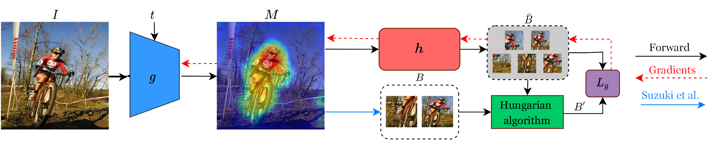
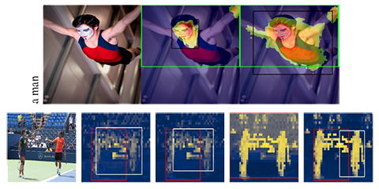

<div align="center">
<h2>Box-based Refinement for Weakly Supervised and Unsupervised Localization Tasks (ICCV 2023)
<br></br>

[](https://arxiv.org/abs/2309.03874)
[](https://www.python.org/downloads/release/python-3912/)


</h2>



</div>


## Abstract
It has been established that training a box-based detector network can enhance the localization performance of weakly supervised and unsupervised methods. Moreover, we extend this understanding by demonstrating that these detectors can be utilized to improve the original network, paving the way for further advancements. To accomplish this, we train the detectors on top of the network output instead of the image data and apply suitable loss backpropagation. Our findings reveal a significant improvement in phrase grounding for the “what is where by looking” task, as well as various methods of unsupervised object discovery.
<a href="https://arxiv.org/abs/2309.03874" rel="nofollow">Paper</a>

## Quick Start

To get started, follow these steps:

1. Clone the repository

```.bash
git clone https://github.com/eyalgomel/box-based-refinement.git
cd box-based-refinement
```

2. Create a new Conda environment
```bash
conda env create -f environment.yml
conda activate bbr
pip install .
```

## Prepare the Data
We follow and adapt the format of the datasets based on [this GitHub repository](https://github.com/hassanhub/MultiGrounding).
Below are examples showcasing the anticipated data structures for each dataset.
### MS-COCO14

```
root/
  ├── annotations/
  │   ├── captions_train2014.json
  │   ├── captions_val2014.json
  |   ├── ...
  ├── images/
  └── labels/
```
### Visual-Genome
```
root/
  ├── VG_Annotations/
  └── VG_Images/
```

### Flickr30K
```
root/
  ├── flickr30k_entities/
  ├── flickr30k_images/
  ├── train.txt
  ├── val.txt
  └── test.txt
```

### Referit
```
root/
  ├── annotations/
  └── ReferIt_Images/
```

### VOC (2007 & 2012) 
```
root/
  ├── Annotations/
  ├── ImageSets/
  ├── JPEGImages/
  ├── SegmentationClass/
  └── SegmentationObject/
```

## Training

For each training script, you have the option to adjust training parameters either using the yaml configuration file or by directly providing them via command line arguments. 
Configuration files may found [here](config/train).

For **Weakly phrase grounding** training, run the command below. 
```bash
python bbr/train/wsg.py \
training.heatmap_model=MODEL_PATH \
data.train.dataset=TRAIN_DATASET \
data.train.data_path=TRAIN_DATASET_PATH \
data.val.dataset=VAL_DATASET \
data.val.data_path=VAL_DATASET_PATH \
training.gpu_num=GPUS_NUMBER
```

Make sure to replace the following placeholders:

* `MODEL_PATH`: The path to the original model checkpoint. You can download it from this [repository](https://github.com/talshaharabany/what-is-where-by-looking).
* `TRAIN_DATASET`: Choose one of the available training datasets: coco, vg.
* `TRAIN_DATASET_PATH`: The path to the training dataset.
* `VAL_DATASET`: Choose one of the available validation datasets: flickr, referit, vg.
* `VAL_DATASET_PATH`: The path to the validation dataset.
* `GPUS_NUMBER`: The GPUS number.


For **Single object discovery** training, run one of the commands below, depends on the underlying method (lost | tokencut | move).
```bash
python bbr/train/od_{method}.py \
data.train.dataset=TRAIN_DATASET \
data.train.data_path=TRAIN_DATASET_PATH \
data.val.dataset=VAL_DATASET \
data.val.data_path=VAL_DATASET_PATH \
training.gpu_num=GPUS_NUMBER \
training.move.model_path=MOVE_MODEL_PATH # RELEVANT FOR MOVE ONLY
```

Make sure to replace the following placeholders:

* `TRAIN_DATASET`: Choose one of the available training datasets: VOC07, VOC12, coco.
* `TRAIN_DATASET_PATH`: The path to the training dataset.
* `VAL_DATASET`: Choose one of the available training datasets: VOC07, VOC12, coco.
* `VAL_DATASET_PATH`: The path to the validation dataset.
* `GPUS_NUMBER`: The GPUS number.


For training `MOVE`, you should download the adapted version of the original model weights `MOVE_MODEL_PATH`, which can be found [here](https://drive.google.com/file/d/1E8v-9M-0x88WKjwJjhXkCbayV8K1A9FU/view?usp=share_link)

## Evaluation
For evaluating our method, you should run the following cmd 
```bash
python bbr/inference/run_inference.py \
task=TASK \
data.dataset=DATASET \
model_path=MODEL_PATH \
data.val_path=DATA_PATH
```

Replace `TASK` with either `od_lost`, `od_tokencut`, `od_move`, or `grounding`. Likewise, replace `DATASET` with `flickr`, `referit`, `vg`, `VOC07`, `VOC12`, or `coco20k`, and replace `DATA_PATH` with the respective dataset path. 

`MODEL_PATH` should be the path to the model weights you intend to evaluate. You can refer to the next section for instructions on obtaining pretrained weights for all tasks: `Pretrained models weights`. Other evaluation parameters can be found in the [configuration](./config/inference/inference.yaml) file.

## Pretrained models weights
Here, you'll find the pertinent links to access pretrained model weights for various tasks:

**Phrase Grounding**
1. [COCO Pretrained Model](https://drive.google.com/file/d/199MF-7KU2MNh3zETZ8fhsfm8XPJRU4qP/view?usp=share_link)
2. [VG Pretrained Model](https://drive.google.com/file/d/1-qANSC75Wsq-YincTq4q-AbANByndj8A/view?usp=share_link)

**Single Object Discovery**
Each folder includes three models for VOC07, VOC12, and COCO20K datasets.
1. [LOST Pretrained Models](https://drive.google.com/drive/folders/19K2vFmfrwaEJxUGUiC3KmZv4lFOzCvpy?usp=share_link)
2. [TokenCut Pretrained Models](https://drive.google.com/drive/folders/1B83ik9wmXMVDIYfONxr_oEyEJ2LsgJwc?usp=share_link)
3. [Move Pretrained Models](https://drive.google.com/drive/folders/1fQ5MEkO7qILnDEBnXCjF6Gtv1Dv6YJrl?usp=share_link)


## Acknowledgments
This repository owes its greatness to some fantastic methods and repositories, and we truly appreciate their contribution.

[CLIP](https://github.com/openai/CLIP),
[DETR](https://github.com/facebookresearch/detr),
[DINO](https://github.com/facebookresearch/dino),
[LOST](https://github.com/valeoai/LOST),
[TokenCut](https://github.com/YangtaoWANG95/TokenCut),
[MOVE](https://github.com/adambielski/move-seg),
[BLIP](https://github.com/salesforce/BLIP)

## License
**The source code for each individual method within this repository is subject to its respective original license**

## Citation
If you discover our work to be inspirational or utilize our codebase in your research, please consider giving a star ⭐ and a citation.
```
@inproceedings{gomel2023boxbasedrefinement,
  title={Box-based Refinement for Weakly Supervised and Unsupervised Localization Tasks},
  author={Gomel, Eyal and Shaharbany, Tal and Wolf, Lior},
  booktitle={Proceedings of the IEEE/CVF International Conference on Computer Vision},
  year={2023}
}
```


